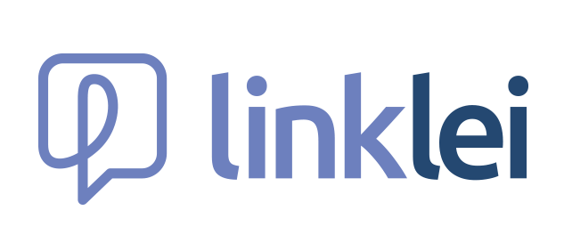

<p align="center"><a href="https://github.com/bernardoenock" target="_blank"></a></p>

<h1 align="center">Teste Tecnico: LinkLei</h1>

## Table of Contents

- [Table of Contents](#table-of-contents)
- [Features](#features)
- [Iniciar a aplicação](#iniciar-a-aplicação)
- [Sobre o teste](#sobre-o-teste)

## Features

- Laravel 8
- PHP 7.2+;
- MySQL 5.6+;
- Compilação JS do Laravel

## Iniciar a aplicação

- Clone o repositorio com os metodos: (https, ssh, gh cli)

- Na raiz suba o Banco de Dados com:
  `docker compose up`

- Copie o .env.example:
  `cp .env.example .env`

- Atualize o composer:
  `composer install` ou `composer update`

- Rodar as migrations:

```
php artisan migrate --seed
```

- Criar o symbolic link

```
php artisan storage:link
```

- Rodar a aplicação localmente:

```
php artisan serve
```

# Sobre o teste

A oportunidade foi dada a mim por uma indicação da [Kenzie](https://kenzie.com.br/) na quinta feira dia 15 de setembro, porem estava com uma viajem programada e voltaria ao meu computador na segunda, para resolver esse problema, consegui um notebook da positivo, configurei e fui conhecer o laravel, para ver se conseguiria fazer o teste, estudei nesse computador ate segunda, tentei começar o teste, porem o notebook não aguentou. Começei o teste oficialmente na segunda.

Foram dias de muito aprendizado, independente do resultado do porcesso seletivo, agradeço a oportunidade e o conhecimento adiquirido.
